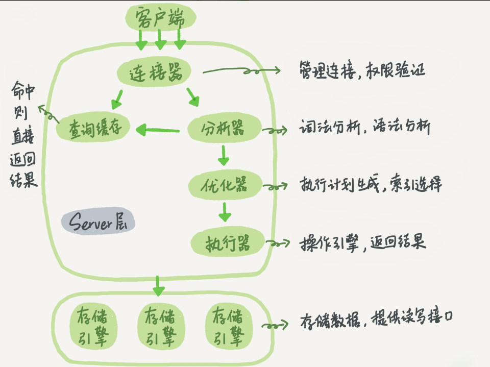

### MySQL 可以分为 Server 层和存储引擎层两部分。
1. Server层包括连接器、查询缓存、分析器、优化器、执行器等、涵盖MySQL得大多数核心服务功能，以及所有得内置函数（如日期时间、数学和加密函数等），所有跨存储引擎的功能都在这一层实现，比如存储过程、触发器、视图等。
2. 存储引擎层负责数据的存储和提取。其架构模式是插件式的，支持InnoDB、MyISAM、Memory等多个存储引擎。不同的存储引擎公用一个Server层。

* * *

### 连接器
1. 负责跟客户端建立连接、获取权限、维持和管理连接。
2. 连接命令一般是这么写的： ```mysql -h$ip -P$port -u$user -p```
    * 如果用户名或密码不对，则会返回一个“Access denied for user”的错误，然后客户端程序结束执行
    * 如果认证通过，连接器会到权限表里面查出你拥有的权限。之后这个连接里面的权限判断逻辑都将依赖于此时读到的权限
3. 连接完成后，如果没有后续动作，这个连接就处于空闲状态，可以使用```show processlist```命令看到他
4. 客户端如果太长时间没动静，连接器就会自动将它断开，这个时间由参数wait_timeout控制，默认值是8小时

* * *

### 查询缓存
1. MySQL拿到一个查询请求后，会先到查询缓存看看，之前是不是执行过这条语句。
2. 之前执行过的语句及其结果可能会以key-value对的形式，被直接缓存再内存中。key是查询的语句，value是查询的结果。
3. 如果语句不在查询缓存中，就会继续后面的执行阶段。执行完成后结果会被存入查询缓存中。
4. 大多数情况下不建议使用查询缓存，查询缓存的失效非常频繁，只要有对一个表的更新，这个表上所有的查询缓存都会被清空。
5. 将参数```query_cache_type```设置成```DEMAND```，这样对于所有的默认SQL语句都不使用查询缓存。对于要使用查询缓存的语句，可以使用SQL_CACHE显示指定，比如：
```select SQL_CACHE * from T where ID=10;```
6. MySql 8.0版本直接将查询缓存的整块功能删掉了。

* * *

### 分析器
1. 分析器先会做“词法分析”。识别出SQL语句中的字符串分表是什么，代表什么。
2. 第二部做“语法分析”，根据语法规则判断SLQL语句是否符合MySQL语法。

* * *

### 优化器
1. 优化器是再表里面有多个索引的时候，决定使用哪个索引；或者再一个语句有多表关联（join）的时候，决定各个表的连接顺序，比如执行下面这样的语句：```select * from t1 join t2 using(ID) where t1.c=10 and t2.d=20;```

    * 既可以先从表t1里面取出c=10的记录的ID值，再根据ID值关联到表t2，再判断t2里面的d的值是否等于20.
    * 也可以先从表t2里面去除d=20的记录的ID值，再根据ID值关联到t1,再判断t1里面c的值是否等于10
2. 这两种执行方法的逻辑结果是一样的，但是执行的效率会有不同，而优化器的作用就是决定使用哪一种方案。

* * *

### 执行器
1. 开始执行的时候，会先判断你对这个表T有没有执行查询的权限（在工程实现上，如果命中查询缓存，会在查询缓存返回结果的时候做权限验证。查询也会在优化器之前调用precheck验证权限）

     ```select * from T where ID=10```
2. 比如我们这个例子中的表 T 中，ID 字段没有索引，那么执行器的执行流程是这样的：
    1. 调用 InnoDB 引擎接口取这个表的第一行，判断 ID 值是不是 10，如果不是则跳过，如果是则将这行存在结果集中；（值得注意的是server层每次是读取一行数据，存储引擎是读取一页的数据，不要弄混）
    2. 调用引擎接口取“下一行”，重复相同的判断逻辑，直到取到这个表的最后一行。
    3. 执行器将上述遍历过程中所有满足条件的行组成的记录集作为结果集返回给客户端。

3. 对于有索引的表，执行逻辑也差不多。第一次调用的是“取满足条件的第一行”这个接口，之后循环取“满足条件的下一行”这个接口，这些接口都是引擎中已经定义好的。

    


