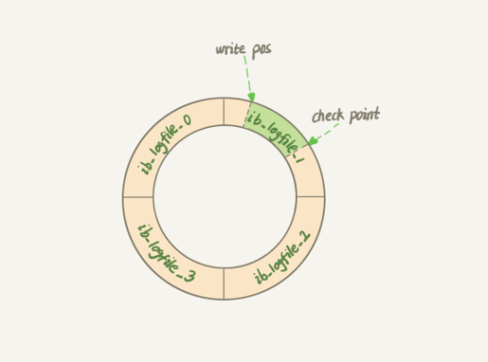
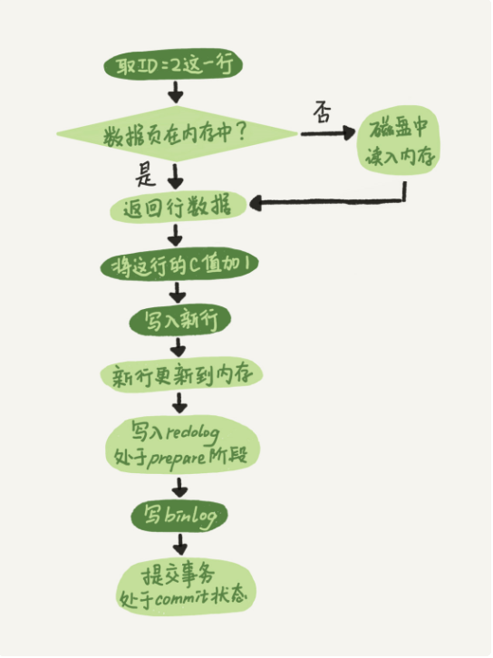

### 更新语句的执行流程

```update T set c=c+1 where ID=2;```

1. 查询语句的那一套流程，更新语句也会同样地走一遍
2. 在一个表上有更新的时候，所有有关这个表的查询缓存都会失效
3. 更新流程涉及到两个重要的日志模块，redo log(重做日志)和binglog（归档日志）

* * *

### redo log

1. 如果每一次的更新操作都需要写进磁盘，然后磁盘也要找到对应的那条记录，然后再更新，整个过程 IO 成本、查找成本都很高。为了解决问题，使用了MySQL里的WAL技术，全称Write-Ahead Logging，他的关键点就是先写日志，再写磁盘。这里说的先写日志也是写磁盘，但这是顺序写盘，不涉及查找，速度很快。

2. 当有一条记录需要更新的时候，InnoDB引擎会先把记录写到redo log里面，并更新内存。同时，InnoDB引擎会再适当的时候，将这个操作记录更新到磁盘里面。

3. InnoDB的redolog是固定大小的，比如可以配置为一组4个文件，每个文件的大小是1GB，那么redo log总共可以记录4GB的操作。从头开始写，写道末尾就又回到开头循环写。如下图所示：


4. write pos是当前记录的位置，一边写一边后移，写道第3号文件抹灰就回到0号文件开头

5. check point是当前要擦除的位置，也是往后推移并且循环的，擦除记录之前要八记录更新到数据文件

6. redo log可以保证即使数据发生异常重启，之前提交的记录都不会丢失，这个能力成为crash-safe

### binlog

1. 上面讲到的redo log是InnoDB引擎特有的日志，而Server层也有自己的日志，成为binlog（归档日志）

2. redo log和binlog有一下3点不同
    * redo log是InnoDB引擎特有的；binlog是MySQL的Server层实现的，所有引擎都可以使用
    * redo log 是物理日志，记录的是“在某个数据页上做了什么修改”；binlog是逻辑日志，记录的是这个语句的原始逻辑，比如“给ID=2这一行的c字段加1”
    * redo log是循环写的，空间固定会用完；binlog是可以追加写入的。“追加写”是指binlog文件写到一定大小后会切换到下一个，并不会覆盖以前的日志。

3. InnoDB引擎在执行update语句时的内部流程
    1. 执行器先找引擎取 ID=2 这一行。ID 是主键，引擎直接用树搜索找到这一行。如果 ID=2 这一行所在的数据页本来就在内存中，就直接返回给执行器；否则，需要先从磁盘读入内存，然后再返回。
    2. 执行器拿到引擎给的行数据，把这个值加上 1，比如原来是 N，现在就是 N+1，得到新的一行数据，再调用引擎接口写入这行新数据。
    3. 引擎将这行新数据更新到内存中，同时将这个更新操作记录到 redo log 里面，此时 redo log 处于 prepare 状态。 然后告知执行器执行完成了，随时可以提交事务。
    4. 执行器生成这个操作的 binlog，并把 binlog 写入磁盘。
    5. 执行器调用引擎的提交事务接口，引擎把刚刚写入的 redo log 改成提交（commit）状态，更新完成。
    流程图如下：
    

### 两阶段提交

1. 将redo log的写入拆成了两个步骤:prepare和commit，这就是两阶段提交

2. 下面例子说明两阶段提交的必要性：
    1. 先写 redo log 后写 binlog。假设在 redo log 写完，binlog 还没有写完的时候，MySQL 进程异常重启。由于我们前面说过的，redo log 写完之后，系统即使崩溃，仍然能够把数据恢复回来，所以恢复后这一行 c 的值是 1。但是由于 binlog 没写完就 crash 了，这时候 binlog 里面就没有记录这个语句。因此，之后备份日志的时候，存起来的 binlog 里面就没有这条语句。然后你会发现，如果需要用这个 binlog 来恢复临时库的话，由于这个语句的 binlog 丢失，这个临时库就会少了这一次更新，恢复出来的这一行 c 的值就是 0，与原库的值不同。

    2. 先写 binlog 后写 redo log。如果在 binlog 写完之后 crash，由于 redo log 还没写，崩溃恢复以后这个事务无效，所以这一行 c 的值是 0。但是 binlog 里面已经记录了“把 c 从 0 改成 1”这个日志。所以，在之后用 binlog 来恢复的时候就多了一个事务出来，恢复出来的这一行 c 的值就是 1，与原库的值不同。


