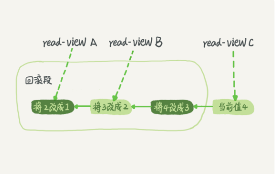

### 隔离性与隔离级别
提到事务就会想到ACID(Atomicity、Consistency、Isolation、Durability)，即原子性，一致性，隔离性，持久性。

多个事务同事执行的时候，可能出现的问题：
1. 脏读：读到其他事务未提交的数据
2. 不可重复读：一个事务前后读取的记录内容不一直
3. 幻读：前后读取的记录数量不一致

事务的隔离性分一下4种：
1. 读未提交：一个事物还没提交时，它做的变更就能被别的事务看到。
2. 读已提交：一个事物提交后，它做的变更才会被其他事务看到。
3. 可重复读：一个事务执行过程中看到的数据，总是跟这个事务在启动时看到的数据是一致的。
4. 串行化：对于同一行记录，“写”会加“写锁”，“读”会加“读锁”。当出现读写锁冲突的时候，后方位的事务必须等待前一个事务执行完成，才能继续执行。

### 事务隔离的实现

对四种隔离级别的实现，是依靠视图来实现的。
1. 读未提交：没有试图概念，直接返回记录的最新值
2. 读已提交：每次执行sql之前创建视图
3. 可重复度：每次创建事务的时候创建视图
4. 串行化：通过加锁来避免并行访问

在MySQL中，实际上每天记录在更新的时候都会同事记录一条回滚操作。记录上的最新值，通过回滚操作，都可以得到前一个状态的值。

假设一个值从 1 被按顺序改成了 2、3、4，在回滚日志里面就会有类似下面的记录。

