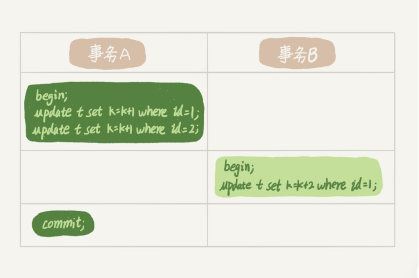
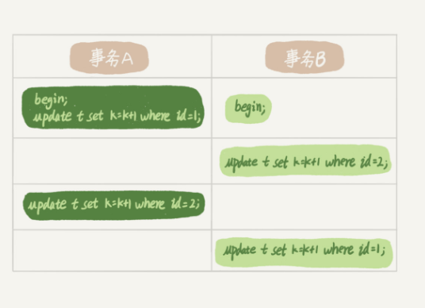

### 全局锁

顾名思义，全局锁就是对整个数据库实例加锁。MySQL 提供了一个加全局读锁的方法，命令是 Flush tables with read lock (FTWRL)。当你需要让整个库处于只读状态的时候，可以使用这个命令，之后其他线程的以下语句会被阻塞：数据更新语句（数据的增删改）、数据定义语句（包括建表、修改表结构等）和更新类事务的提交语句。

### 表级锁

MySQL里面表级别的锁有两种：一种是表锁，一种是元数据锁（meta data lock, MDL）

#### 表锁
1. 表锁的语法：lock tables ... read/write，解锁：unlock tables
2. 如果在某个线程A中执行了lock tables t1 read, t2 write;，其他线程写t1、读写t2的语句都会被阻塞。同时，线程A在执行unlock tables之前，也只能执行读t1、读写t2的操作。

#### MDL
1. 当对一个表做增删改查操作的时候，加MDL读锁；当要对表结构变更操作的时候，加MDL写锁
2. 读锁之间不互斥，因此你可以有多个线程同时对一张表增删改查
3. 读写锁之间、写锁之间是互斥的，用来保证表更表结构操作的安全性。因此，如果有两个线程要同时给一个表加字段，其中一个要等另一个执行完才能开始执行
4. 事务不提交的话，就会一直占着MDL锁。

### 行锁

顾名思义，行锁是针对数据表中行记录的锁。比如事务A更新了一行，而这时候事务B也要更新同一行，则必须等事务A的操作完成后才能进行更新。

1. 两阶段锁

    图中事务B的update语句会被阻塞，知道事务A执行commit之后，事务B才能继续执行。
也就是说，在InnoDB事务中，行锁是在需要的时候才加上的，但并不是不需要了就立刻释放，二十要等到事务结束时才释放。这个就是两阶段锁协议。
    如果你的事务中需要锁多个行，要把最可能造成锁冲突、最可能影响并发度的锁尽量往后放。

2. 死锁和死锁检测
    当并发系统中不同线程出现循环资源以来，设计的线程都在等待别的线程释放资源时，就会导致这几个线程都进入无限等待的状态，称为死锁。
    
    死锁出现后的两种策略：
    * 直接进入等待，直到超时。超时时间通过innodb_lock_wait_timeout设置，默认值为50s
    * 发起死锁检测，发现死锁后，主动回滚死锁链条中的某一个事务，让其他事务得以继续执行。将参数innodb_deadlock_detect设置为on，表示开启这个逻辑