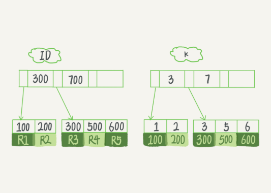

### 查询过程

SQL语句：select id from T where k=5

这个查询在索引书上查找的过程，显示通过B+树从树根开始，按层搜索到叶子节点，也就是途中右下角这个数据页，然后可以认为数据页内部通过二分法来定位记录
* 对于普通索引来说，查找到满足条件的第一个记录（5，500）后，需要查找下一个记录，知道碰到第一个不满足k=5条件的记录
* 对于唯一索引来说，由于索引定义了唯一性，查找到第一个满足条件的记录后，就会停止继续检索

这两种不同带来的性能时微乎其微的，因为InnoDB的数据是按数据页为单位来读写的。也就是说，当需要读一条记录的时候，并不是将这个记录本身从磁盘读出来，而是以页为单位，将其整体读入内存。

### 更新过程

#### change buffer
当需要更新一个数据页时，如果数据页在内存中就直接更新，而如果这个数据页还没有在内存中的话，在不影响数据一致性的前提下，InnoDB会将这些更新操作缓存在change buffer中，这样就不需要从磁盘中读取这个数据页了。在下次查询需要访问这个数据页的时候，将数据页读入内存，然后执行change buffer中与这个页有关的操作。

将 change buffer 中的操作应用到原数据页，得到最新结果的过程称为 merge。除了访问这个数据页会触发 merge 外，系统有后台线程会定期 merge。在数据库正常关闭（shutdown）的过程中，也会执行 merge 操作。

对于唯一索引来说，所有更新操作都要先判断这个操作是否违反唯一性约束。必须将数据读入到内存才能判断，所以用不到change buffer。

change buffer只限于用在普通索引的场景下：
1. 这个记录要更新的目标页在内存中，不会使用change buffer
2. 这个记录要更新的目标页不在内存中，将更新记录在change buffer，语句执行就结束了