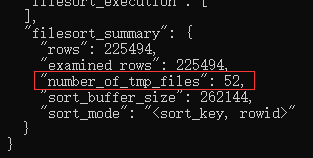

表定义：
```
CREATE TABLE `t` (
     `id` int(11) NOT NULL, 
     `city` varchar(16) NOT NULL, 
     `name` varchar(16) NOT NULL, 
     `age` int(11) NOT NULL, 
     `addr` varchar(128) DEFAULT NULL, 
     PRIMARY KEY (`id`), 
     KEY `city` (`city`)
) ENGINE=InnoDB;
```

SQL语句：
```
select city,name,age from t where city='杭州' order by name limit 1000 ;
```

### 全字段排序

通常情况下这个语句的执行流程如下所示：
1. 初始化sort_buffer,确定放入name、city、age这三个字段
2. 从索引city找到第一个满足city='杭州'条件的主键id
3. 到主键id索引取出整行，取name、city、age三个字段的值，存入sort_buffer中
4. 从索引city取下一个记录的主键id
5. 重复步骤3、4知道city的值不满足查询条件为止
6. 对sort_buffer中的数据按照字段name做快速排序
7. 按照排序结果取前1000行返回给客户端

流程图如下：


“按name排序”这个动作，可能在内存中完成，也可能需要使用外部排序，这取决于排序所需的内存和参数sort_buffer_size。

sort_buffer_size，就是MySQL为排序开辟的内存（sort_buffer）的大小。如果要排序的数据量小于sort_buffer_size，排序就在内存中完成。如果排序数据量太大，内存放不下，则不得不利用磁盘临时文件辅助排序。

下面的方法可以确定一个排序语句是否使用了临时文件：
```
/* 打开optimizer_trace，只对本线程有效 */
SET optimizer_trace='enabled=on'; 

/* @a保存Innodb_rows_read的初始值 */
select VARIABLE_VALUE into @a from  performance_schema.session_status where variable_name = 'Innodb_rows_read';

/* 执行语句 */
select city, name,age from t where city='杭州' order by name limit 1000; 

/* 查看 OPTIMIZER_TRACE 输出 */
SELECT * FROM `information_schema`.`OPTIMIZER_TRACE`\G

/* @b保存Innodb_rows_read的当前值 */
select VARIABLE_VALUE into @b from performance_schema.session_status where variable_name = 'Innodb_rows_read';

/* 计算Innodb_rows_read差值 */
select @b-@a;
```


图中的number_of_tmp_files表示的是，排序过程中使用的临时文件数。当内存放不下时，就需要使用外部排序，外部排序一般使用归并排序算法。MySQL将需要排序的数据分成52分，每一份单独排序后存在这些临时文件中。然后把这12个有序文件再合并成一个有序的大文件。

如果sort_buffer_size超过了需要排序的数据量大小，number_of_tmp_files这个值就是0。

### rowid排序
```
SET max_length_for_sort_data = 16;
```

max_length_for_sort_data，是MySQL中专门控制用于排序的行数据的长度的一个参数。如果单行的长度超过这个值，MySQL就认为单行太大，要换一个算法。

city、name、age这三个字段的定义总长度是36，小于max_length_for_sort_data设置的16。这个时候整个SQL语句的执行流程如下所示：
1. 初始化 sort_buffer，确定放入两个字段，即 name 和 id；
2. 从索引 city 找到第一个满足 city='杭州’条件的主键 id；
3. 到主键 id 索引取出整行，取 name、id 这两个字段，存入 sort_buffer 中；
4. 从索引 city 取下一个记录的主键 id；
5. 重复步骤 3、4 直到不满足 city='杭州’条件为止；
6. 对 sort_buffer 中的数据按照字段 name 进行排序；
7. 遍历排序结果，取前 1000 行，并按照 id 的值回到原表中取出 city、name 和 age 三个字段返回给客户端。

这时候因为每一行都变小了，number_of_tmp_files也相应地变小了。

### 全字段排序 VS rowid 排序
如果 MySQL 实在是担心排序内存太小，会影响排序效率，才会采用 rowid 排序算法，这样排序过程中一次可以排序更多行，但是需要再回到原表去取数据。

如果 MySQL 认为内存足够大，会优先选择全字段排序，把需要的字段都放到 sort_buffer 中，这样排序后就会直接从内存里面返回查询结果了，不用再回到原表去取数据。

这也就体现了 MySQL 的一个设计思想：如果内存够，就要多利用内存，尽量减少磁盘访问。对于 InnoDB 表来说，rowid 排序会要求回表多造成磁盘读，因此不会被优先选择。