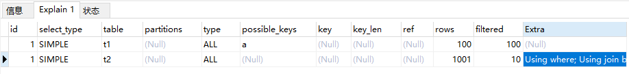

```
CREATE TABLE `t2` (
  `id` int(11) NOT NULL,
  `a` int(11) DEFAULT NULL,
  `b` int(11) DEFAULT NULL,
  PRIMARY KEY (`id`),
  KEY `a` (`a`)
) ENGINE=InnoDB;

drop procedure idata;
delimiter ;;
create procedure idata()
begin
  declare i int;
  set i=1;
  while(i<=1000)do
    insert into t2 values(i, i, i);
    set i=i+1;
  end while;
end;;
delimiter ;
call idata();

create table t1 like t2;
insert into t1 (select * from t2 where id<=100)
```

### Index Nested-Loop Join
```
select * from t1 straight_join t2 on (t1.a=t2.a);
```

这个语句的执行流程如下：
1. 从表t1中读一行数据R
2. 从数据行R中，取出a字段到表t2里查找
3. 取出表t2中满足条件的行，跟R组成一行，作为结果集的一部分
4. 重复执行步骤1到3，知道表t1的末尾循环结束

这个过程是先遍历表t1，然后根据从表t1中取出的每行数据中的a值，去表t2中查找满足条件的记录。在形式上，这个过程就跟我们写程序时的嵌套查询类似，并且可以用上被驱动表的索引，所以我们称之为"Index Nested-Loop Join"，简称NLJ。

* * *

怎么选择被驱动表？

上面这个join语句执行过程中，驱动表走的是全表扫描，而被驱动表走的是树搜索

假设被驱动表的行数是M。每次再被驱动表查一行数据，要先搜索索引a，再搜索主键索引。每次搜索一棵树近似复杂度是以2为底的M的对数，记为logM，所以再被驱动表上查一行的时间复杂度是2*logM

假设驱动表的行数是N，执行过程就要扫描驱动表N行，然后对于每一行，到被驱动表上匹配一次。

所以整个过程的近似时间复杂度是N+N*2*logM

得出结论：
1. 使用join语句，性能必强行拆成多个单表执行SQL语句的性能要好
2. 如果使用join语句的话，需要让小表做驱动

这个结论的前提是"可以使用被动表的索引"

### Block Nested-Loop Join
```
select * from t1 straight_join t2 on (t1.a=t2.b);
```
上面SQL语句的被驱动表上没有可用的索引，算法的流程如下所示：
1. 把表t1的数据读入线程内存join_buffer中，由于我们这个语句中写的是select *，因此是把整个t1放入了内存
2. 扫描表t2，把表t2中的每一行取出来，跟join_buffer中的数据做对比，满足join条件的，作为结果集的一部分返回

explain如下所示：


怎么选择被驱动表？

假设小表的行数是N，大表的行数是M，那么在这个算法里：
1. 两个表都做一次全表扫面，所以总的扫描行数是M+N
2. 内存中判断的次数是M*N

所以使用哪张表做驱动表都无区别。

join_buffer 的大小是由参数 join_buffer_size 设定的，默认值是 256k。如果t1表数据过大，无法放入join_buffer中，则会选择分段放的策略。

将join_buffer_size改成1200，执行过程就会变成：
1. 扫描表t1，顺序读取数据行放入join_buffer中，放完第88行join_buffer满了，继续第2步
2. 扫描表t2，把t2中的每一行取出来，跟join_buffer中的数据做对比，满足join调教的，作为结果集的一部分返回
3. 清空join_buffer
4. 继续扫描表t1，顺序读取最后的12行数据放入join_buffer中，继续执行第2步

得出的结论是，用小表做驱动表比较好。

### 什么是小表
在决定哪个表做驱动表的时候，应该是两个表按照各自的条件过滤，过滤完成之后，计算参与 join 的各个字段的总数据量，数据量小的那个表，就是“小表”，应该作为驱动表。


### 总结
1. 如果可以使用被驱动表的索引，join 语句还是有其优势的
2. 不能使用被驱动表的索引，只能使用 Block Nested-Loop Join 算法，这样的语句就尽量不要使用
3. 在使用 join 的时候，应该让小表做驱动表


