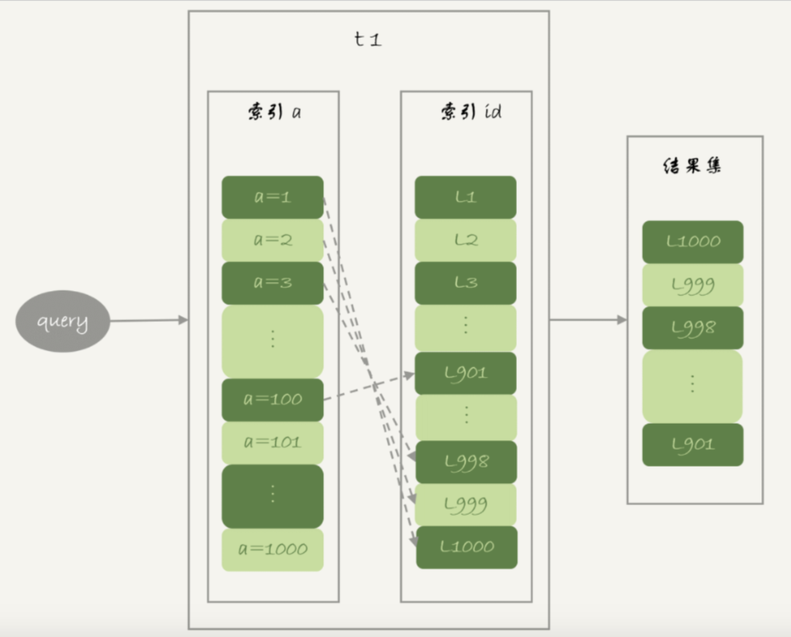
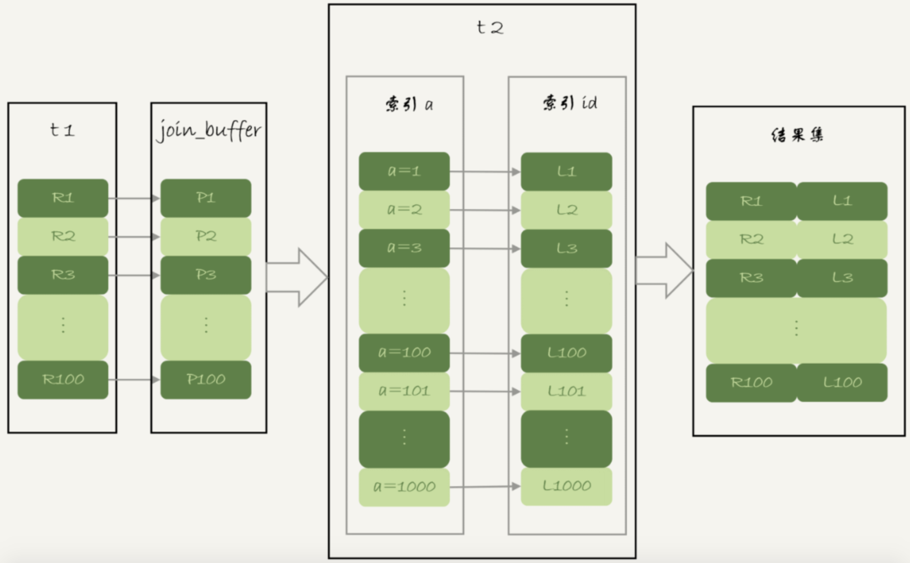

```
create table t1(id int primary key, a int, b int, index(a));
create table t2 like t1;
drop procedure idata;
delimiter ;;
create procedure idata()
begin
  declare i int;
  set i=1;
  while(i<=1000)do
    insert into t1 values(i, 1001-i, i);
    set i=i+1;
  end while;
  
  set i=1;
  while(i<=1000000)do
    insert into t2 values(i, i, i);
    set i=i+1;
  end while;

end;;
delimiter ;
call idata();
```

### Multi-Range Read 优化
```
select * from t1 where a>=1 and a<=100;
```
假设执行上面这条语句，基本流程入下图所示：


随着a的值递增顺序查询的话，id的值就变成谁记得，那么就会出现随机访问，性能相对较差。

MRR优化的设计思路：因为大多数的数据都是按照主键递增顺序插入得到的，所以我们可以认为，如果按照主键的递增顺序查询的话，对磁盘的读比较近顺序读，能提升读性能。

所以语句的执行流程变成了这样：
1. 根据索引a，定位到满足条件的记录，将id值放入read_rnd_buffer中
2. 将read_rnd_buffer中的id进行递增排序
3. 排序后的id数组，一次到主键id索引中查记录，并作为结果返回

read_rnd_buffer的大小是由read_rnd_buffer_size参数控制的。如果步骤1中，read_rnd_buffer放满了，就会执行完步骤2和3，然后清空read_rnd_buffer。之后继续找索引a的下个记录，并继续循环

小结：MRR能够提升性能的核心在于，这条查询语句在索引a上做的是一个范围查询（也就是说，这是一个多只查询），可以得到足够多的主键id。这样通过排序以后，再去主键索引查数据，才能体现出"顺序性"的优势

### Batched Key Access
BKA算法是对NLJ算法的优化，NLJ算法执行的逻辑是：从驱动表t1，一行行地取出a的值，再到被驱动表t2去做join

BKA算法执行逻辑是，把表t1的数据取出来一部分，先放到join_buffer中，而不是一行一行取出，这样就能用到上面说的MRR优化
如下图所示：


如果要使用BKA优化算法的话，需要在执行SQL语句之前，先设置：
```
set optimizer_switch='mrr=on,mrr_cost_based=off,batched_key_access=on';
```
前两个参数的作用是要启用MRR。
